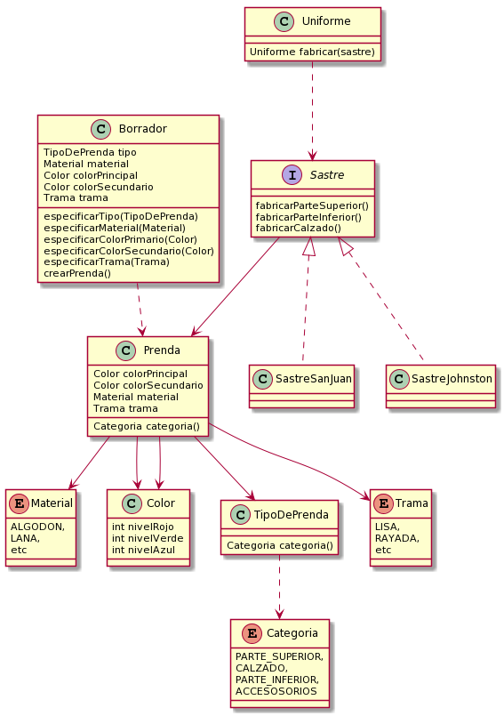

# Que-me-pongo

### Requerimientos
* Como usuarie de QuéMePongo, quiero poder conocer las condiciones climáticas de Buenos
Aires en un momento dado para obtener sugerencias acordes.
* Como usuarie de QuéMePongo, quiero poder recibir sugerencias de atuendos que tengan una
prenda para cada categoría, aunque a futuro podrán tener más (Ej.: Una remera, un pantalón,
zapatos y un gorro).
* Como usuarie de QuéMePongo, quiero que al generar una sugerencia las prendas sean
acordes a la temperatura actual sabiendo que para cada prenda habrá una temperatura hasta
la cual es adecuada. (Ej.: “Remera de mangas largas” no es apta a más de 20°C)
* Como administradore de QuéMePongo, quiero poder configurar fácilmente diferentes servicios
de obtención del clima para ajustarme a las cambiantes condiciones económicas.
* Como stakeholder de QuéMePongo, quiero poder asegurar la calidad de 1 mi aplicación sin
incurrir en costos innecesarios.

### Diagrama de clases

> - 
  
> - Link uml Plantuml http://www.plantuml.com/plantuml/uml/bLF1Rjiw4BplL_0e0ug_80YY9_i53jp8iE82xQNOKhJBGYAD5PL3sFvxQOgYgIGeq0l9dHdkBWVB-zuWcQ5hWRVOz-pG3qXIMzZAtjpkIAW6xzY30niaqcViePH3WmtZVWDuqR9XU29nGXhrsRWjHkeabA18FSkpNeano4lTQWhh9pI29BRvCs7dxi9l22sDzQn7rches2Hb5ehjGxMgddBO5az53i9mfohzjR66q_ZyZ5_M7Kd5vHdR5Am57voIf8QOkGi7yDqmSraXxPqP5q3fP2VjX8nFfsm1iGLVn89KXYdv8jgz_gclqMT1ZRY6nUlGkflXQbhBVbmd-X5P2xjY_xp-LXzsw_scskTG5jklnQhA0x5v-ZyGHLckwwgkN5J7HFwn5hQRsdcvBxuKg-1fREi_JOID9cRVk_7UlN-nFZKQH7yMN1ubHxgKcKtD8cMdajbqcB5bADnTAcG-clDf3nygV5TP64bE8ixnukh9GScZfavOc4xiYD_fSZthiJSal7YZZA0ZSi5g3rgOL3ia8-hXB4XgoXPpVAEER_4IsrTiTD93I5cZUXnGMNXBFEeVgZTQiP4AdvpTtDo5RpA3ol2pHyf3axq9DXlH5FSk_XNmVaASfUKojf7cz7YSROZkUdny5umRk_srNCuzI9cv2P5ANd_lrg5h_m00
  
### Codigo: Proyecto de Java - Que-me-pongo
