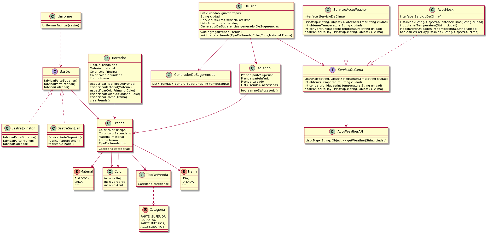

# Que-me-pongo
<h2>Solución: </h2>
<h3>Requerimientos: </h3>
<ul>
<li>Poder cargar  prendas válidas para generar atuendos con ellas.</li>
<li>Especificar qué tipo de prenda se está cargando.</li>
<li>Identificar la categoría a la que pertenece una prenda.</li>
<li>Identificar el material de una prenda.</li>
<li>Indicar color principal de una prenda.</li>
<li>Indicar en caso de existir, el color secundario de una prenda.</li>	
<li>Evitar que haya prendas sin tipo, material, categoría o color primario.</li>
<li>Evitar que una prenda se contradiga con su tipo.</li>
</ul>
 
<h3>Diagrama de clases:<h3>

  
  
<h3> Codigo: </h3>

<?php
include("codigo.java");
?>
