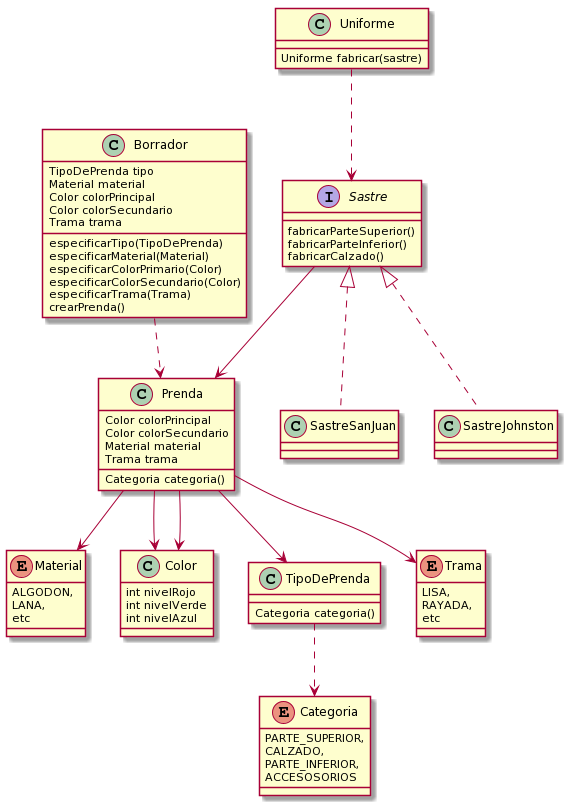

# Que-me-pongo
<h2>Solución: </h2>
<h3>Requerimientos: </h3>
<ul>
<li>Poder cargar  prendas válidas para generar atuendos con ellas.</li>
<li>Especificar qué tipo de prenda se está cargando.</li>
<li>Identificar la categoría a la que pertenece una prenda.</li>
<li>Identificar el material de una prenda.</li>
<li>Indicar color principal de una prenda.</li>
<li>Indicar en caso de existir, el color secundario de una prenda.</li>	
<li>Evitar que haya prendas sin tipo, material, categoría o color primario.</li>
<li>Evitar que una prenda se contradiga con su tipo.</li>
</ul>
 
<h3>Diagrama de clases (desactualizado):<h3>

  
> - Link uml Plantuml http://www.plantuml.com/plantuml/png/bLF1Zfim4BtFL_W8KZPVKAtM9Md5AWq8ifNQIpKbfdK5TZIO7fRstsiCE2QAAkt5yRmtdlVyOfuwWsJwje6zwbls2OqWYGqRW1y-Phlik843F_8D25F1NqWQx3gMar1dj3s9RZInQbnpaggI5sn2i1HLRpj9Ql2Jsta39y8McHbNI2puGrkOLSikYi4Bkf43I6MOahz5K-XV-bfz5dGMrvA_zeqzEHyzoOlUYSdnS5_7Da-tz-m0EIzE-s_bIxulqgpOGC8FN_aksyn4Ulmm4pn9zcLMPhOg_I1tjG4EQMcJA_WNlfiJzBRUQo8yQs83X0wPiSMThDuGT1WhYEuYAbdB2ccKYKAjE6GNoMZPhDXa5cv7XSXLQpxqSBV3kOhS6aD50cao4SNNJ5wKh3MrOe1bnshyJkFngCFEa73DgR8EQwm4AnqumDAL8nbHzXTXFL0Kh_5KrRTuWiqhddNWOHvPedhkKGrmIpphdwepMh69cl-qXuT7_-M4M9XsYBju_WkueC0_aktsaSrZmfaEzuyMV6mEdmp3zCFU_TbkrvTRC-7jF6MTBB9FTktRvXy0
  
  
<h3> Codigo: </h3>

En el archivo codigo.java
:wq

