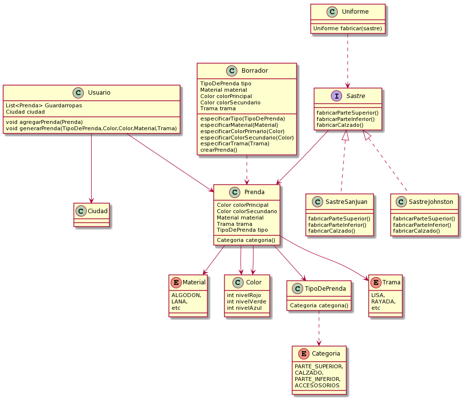

# Que-me-pongo

### Requerimientos
* Como usuarie de QuéMePongo, quiero poder conocer las condiciones climáticas de Buenos
Aires en un momento dado para obtener sugerencias acordes.
* Como usuarie de QuéMePongo, quiero poder recibir sugerencias de atuendos que tengan una
prenda para cada categoría, aunque a futuro podrán tener más (Ej.: Una remera, un pantalón,
zapatos y un gorro).
* Como usuarie de QuéMePongo, quiero que al generar una sugerencia las prendas sean
acordes a la temperatura actual sabiendo que para cada prenda habrá una temperatura hasta
la cual es adecuada. (Ej.: “Remera de mangas largas” no es apta a más de 20°C)
* Como administradore de QuéMePongo, quiero poder configurar fácilmente diferentes servicios
de obtención del clima para ajustarme a las cambiantes condiciones económicas.
* Como stakeholder de QuéMePongo, quiero poder asegurar la calidad de 1 mi aplicación sin
incurrir en costos innecesarios.

### Diagrama de clases

> - 
  
> - Link uml Plantuml http://www.plantuml.com/plantuml/png/jLJ1Rjim3BtpAtHq03TVK1JrdAn8aTL1d0pOBWCdAva6MmfekOTw-_V9igp8Qp5Wm7QHnFSeadwaVDyQ9DCrDV0QsvOTsmv9wXwsiZMtEnAgmZlsOC4AYVG5MyXbLs75kDi0dhMi69v9d956_sJS5YDr5afGe0xoebTYDD9Srvhy-W6D88brUY1ix5tu2RwaCL_laBNg6ZQviXwoxKEnAfvIs6PFMGh2SEkLksjZ3klZuZC-h3kIYiiBrZ5O2jvPJv8QGkJ67y1LmyomGbmxCzQ0tBgTjNLaV3eb2mWbk2GzI6MOai-Ytkll-cfz55I9gvczTBMzwQ_6kVgtymGz0jl3BjiVrb_AuswztnJx5F9i-pbR5QadDa_lFP7b-Reioi9QPGZaFjQsVbDQBVVPfspbDGrblTD4M6bY_MirNgltDzB7GeDeBuBBa-H8GvhPr2nYTagPJ8SPc_l4pP0XSTQSZsjuqyDLbVYHv2J272-kcXoLF6bgH0_JYPtmAmtNanPRGy8vRvGHT48kMEd07YQl7P8HPNSH93KbYpc-KQVVyHph5wnqL8CFMQ9wx53zXyYF-fjgZLRi7yNslnbsStFd7seC-ISFC58EcXeSO_5OnBZhuny1rr48qxnSXZBYc0uFhmj2Vnq-2WFZncv_B9VpBioPMCL0HLz_RzUkgNy1
  
### Codigo: Proyecto de Java - Que-me-pongo
