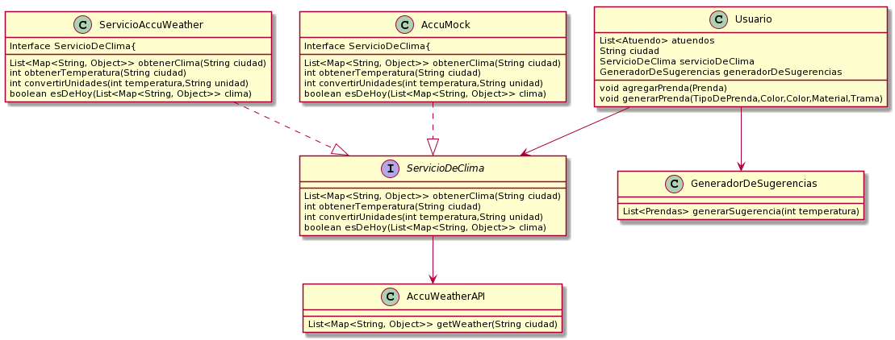

# Que-me-pongo

## ¡Cuarta Iteración!

### Requerimientos
* Como usuarie de QuéMePongo, quiero poder conocer las condiciones climáticas de Buenos
Aires en un momento dado para obtener sugerencias acordes.
* Como usuarie de QuéMePongo, quiero poder recibir sugerencias de atuendos que tengan una
prenda para cada categoría, aunque a futuro podrán tener más (Ej.: Una remera, un pantalón,
zapatos y un gorro).
* Como usuarie de QuéMePongo, quiero que al generar una sugerencia las prendas sean
acordes a la temperatura actual sabiendo que para cada prenda habrá una temperatura hasta
la cual es adecuada. (Ej.: “Remera de mangas largas” no es apta a más de 20°C)
* Como administradore de QuéMePongo, quiero poder configurar fácilmente diferentes servicios
de obtención del clima para ajustarme a las cambiantes condiciones económicas.
* Como stakeholder de QuéMePongo, quiero poder asegurar la calidad de 1 mi aplicación sin
incurrir en costos innecesarios.

### Diagrama de la iteracion:
> - 
> - Link plantuml http://www.plantuml.com/plantuml/png/vPJHgk9038RlynHpMQ7w158K2xl2oWegUnsdsMvsfpEIcH6MdlFkHpijOgbFu8qsoV-7VAJfoWUK41i3sg3twkGZ2hiMVh0FotM8P2jNA4mF7Wv1sDPASwomWWF9bJMxaZQ66rJ-EOPlP4cmSbBI8TOaP3MZL_La6k3gk59O2zKeUo5ROPR-PgcKV4Ffo1TNKWhoZJDE-jyT1X96any5cviNFW6sDf3yHargD7CBgaFTuMMPu7Bry_oNT2WAvSw1B4adp9xGPw3OXa5mfEP2WY7Aj4mxUoK9B2VBjopvx9uD3rVUkwBbv3exPmYj8b_IT_S_UpsZDZn0RheL3e1hhUClml27f7qd_Zltpkb_xmOzB7kztxRmsbfJw8MZgH_Dfi-sRveEpXV3DJuKOxwkuyJRg1QBZsAy4XZMDbqTnMe-BqRC0FstwruR-vzgqtYmkd75ndm1

### Diagrama de clases acumulado

> - 
  
> - Link uml Plantuml http://www.plantuml.com/plantuml/png/jLJ1Rjim3BtpAtHq03TVK1JrdAn8aTL1d0pOBWCdAva6MmfekOTw-_V9igp8Qp5Wm7QHnFSeadwaVDyQ9DCrDV0QsvOTsmv9wXwsiZMtEnAgmZlsOC4AYVG5MyXbLs75kDi0dhMi69v9d956_sJS5YDr5afGe0xoebTYDD9Srvhy-W6D88brUY1ix5tu2RwaCL_laBNg6ZQviXwoxKEnAfvIs6PFMGh2SEkLksjZ3klZuZC-h3kIYiiBrZ5O2jvPJv8QGkJ67y1LmyomGbmxCzQ0tBgTjNLaV3eb2mWbk2GzI6MOai-Ytkll-cfz55I9gvczTBMzwQ_6kVgtymGz0jl3BjiVrb_AuswztnJx5F9i-pbR5QadDa_lFP7b-Reioi9QPGZaFjQsVbDQBVVPfspbDGrblTD4M6bY_MirNgltDzB7GeDeBuBBa-H8GvhPr2nYTagPJ8SPc_l4pP0XSTQSZsjuqyDLbVYHv2J272-kcXoLF6bgH0_JYPtmAmtNanPRGy8vRvGHT48kMEd07YQl7P8HPNSH93KbYpc-KQVVyHph5wnqL8CFMQ9wx53zXyYF-fjgZLRi7yNslnbsStFd7seC-ISFC58EcXeSO_5OnBZhuny1rr48qxnSXZBYc0uFhmj2Vnq-2WFZncv_B9VpBioPMCL0HLz_RzUkgNy1
  
### Codigo: Proyecto de Java - Que-me-pongo
### Código de iteración simplificado y resumido:

```java
public class Usuario {
    String ciudad;
    List<Atuendo> atuendos = new ArrayList<Atuendo>();
    GeneradorDeSugerencias generadorDeSugerencias;
    ServicioDeClima servicioDeClima;


    public void agregarAtuendo(Atuendo atuendo){
        this.atuendos.add(atuendo);
    }
    public void generarAtuendo(Prenda superior,Prenda inferior,Prenda calzado, List<Prenda> accesorios){
        agregarAtuendo(new Atuendo(superior,inferior,calzado,accesorios));
    }

    public List<Atuendo> sugerenciasDelDia(){
        return this.generadorDeSugerencias.generarSugerencia(atuendos,this.servicioDeClima.obtenerTemperatura(ciudad));
    }


}

public class GeneradorDeSugerencias {

    public List<Atuendo> generarSugerencia(List<Atuendo> atuendos,int temperatura){
        return atuendos.stream().filter(atuendo -> atuendo.atuendoAptoTemperatura(temperatura))
                .collect(Collectors.toList());
    }
}


public final class AccuWeatherAPI {

    public final List<Map<String, Object>> getWeather(String ciudad) {
        return Arrays.asList(new HashMap<String, Object>(){{
            put("DateTime", "2019-05-03T01:00:00-03:00");
            put("EpochDateTime", 1556856000);
            put("WeatherIcon", 33);
            put("IconPhrase", "Clear");
            put("IsDaylight", false);
            put("PrecipitationProbability", 0);
            put("MobileLink", "http://m.accuweather.com/en/ar/villa-vil/7984/");
            put("Link", "http://www.accuweather.com/en/ar/villa-vil/7984");
            put("Temperature", new HashMap<String, Object>(){{
                put("Value", 57);
                put("Unit", "F");
                put("UnitType", 18);
            }});
        }});
    }
}

public interface ServicioDeClima {
    public List<Map<String, Object>> obtenerClima(String ciudad);
    public int obtenerTemperatura(String ciudad);
    public int convertirUnidades(int temperatura,String unidad);
    public boolean esDeHoy(List<Map<String, Object>> clima);

}

public class ServicioAccuWeather implements ServicioDeClima{
    AccuWeatherAPI servicioClima;
    List<Map<String, Object>> clima;
    @Override
    public List<Map<String, Object>> obtenerClima(String ciudad) {
        if(!esDeHoy(clima)){
            this.clima=servicioClima.getWeather(ciudad);
        }
        return clima;
    }
    //Todo
    //No se como manejar el esto, así que meto un hardcodeado loco
    //No, este no es el mock (pero falta aclarar esa duda).
    @Override
    public int obtenerTemperatura(String ciudad) {
        int temperatura=57;
        return convertirUnidades(temperatura,"F");
    }

    @Override
    public int convertirUnidades(int temperatura,String unidad){
        if(unidad=="F"){
            return (temperatura-32)*(5/9);
        }
        //Todo. A futuro pensar si se necesitan otros factores de converción.
        return temperatura;
    }

    //Todo
    @Override
    public boolean esDeHoy(List<Map<String, Object>> clima){
        return true;
    }
}

public class AcuMock implements ServicioDeClima{

    @Override
    public final List<Map<String, Object>> obtenerClima(String ciudad) {
        return Arrays.asList(new HashMap<String, Object>(){{
            put("DateTime", "2019-05-03T01:00:00-03:00");
            put("EpochDateTime", 1556856000);
            put("WeatherIcon", 33);
            put("IconPhrase", "Clear");
            put("IsDaylight", false);
            put("PrecipitationProbability", 0);
            put("MobileLink", "http://m.accuweather.com/en/ar/villa-vil/7984/");
            put("Link", "http://www.accuweather.com/en/ar/villa-vil/7984");
            put("Temperature", new HashMap<String, Object>(){{
                put("Value", 57);
                put("Unit", "F");
                put("UnitType", 18);
            }});
        }});
    }

    //Esto es un Mock. Necesito que me devuelva un valor cualquiera para testear (Y para evitar esos 0.5USD)
    @Override
    public int obtenerTemperatura(String ciudad) {
        int temperatura=57;
        return convertirUnidades(temperatura,"F");
    }

    @Override
    public int convertirUnidades(int temperatura,String unidad){
        if(unidad=="F"){
            return (temperatura-32)*(5/9);
        }
        return temperatura;
    }

    @Override
    //Todo
    public boolean esDeHoy(List<Map<String, Object>> clima) {
        return true;
    }


}
```
