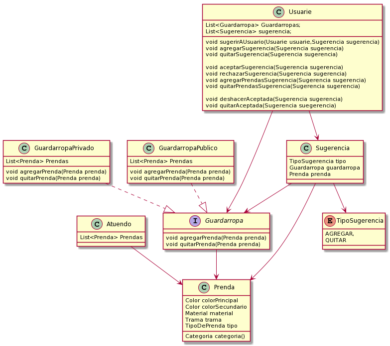

# Que-me-pongo

## ¡Quinta iteración!

### Diagrama de la iteracion:
>  

### Requerimientos
- ###  _Como usuarie de QuéMePongo, quiero compartir mis guardarropas con otras personas._
* Como usuarie de QuéMePongo, quiero poder manejar varios guardarropas para separar mis
prendas según diversos criterios (ropa de viaje, ropa de entrecasa, etc).
 ```java
//Esto lo solucionamos utilizando implementando una clase Guardarropa


public Class Guardarropa{
List<Prenda> prendas; 

 public void agregarPrenda(Prenda prenda){
 this.Prendas.add(prenda);
 }
}
```
* Como usuarie de QuéMePongo, quiero poder crear guardarropas compartidos con otros
usuaries (ej, ropa que comparto con mi hermane).
```java
//Se me ocurrió que Guardarropa podría ser una interface, implementada por GuardarropaPublico y GuardarropaPrivado

public Interface Guardarropa{
void agregarPrenda();
}

public Class GuardarropaPublico implements Guardarropa{
List<Prenda> prendas; 

 public void agregarPrenda(Prenda prenda){
 this.Prendas.add(prenda);
 }
}

Public Class GuardarropaPrivado implements Guardarropa{
List<Prenda> prendas; 

 public void agregarPrenda(Prenda prenda){
 this.prendas.add(prenda);
 }
 public void quitarPrenda(Prenda prenda){
 this.prendas.remove(prenda);
 }
}

//Sin embargo esto me huele mal, ya que son dos clases iguales. 
//Quería hacer que un guardarropas publico conociese los usuarios que lo comparten, 
//pero me traía una doble referencia que quise evitar.
```
* Como usuarie de QuéMePongo, quiero que otro usuario me proponga tentativamente agregar
una prenda al guardarropas.
```java
//Esto lo hice modelando la clase Sugerencia, que conociese el guardarropas a modificar y la prenda.

public Class Sugerencia{
Guardarropa guardarropa;
Prenda prenda;
}

//Agregando una sugerencia al usuario, que tiene que saber que puede agregar esta prenda

public Class Usuario{
Guardarropa guardarropas;
List<Sugerencia> sugerencia;

//Este metodo se utilizaría para que un usuario le sugiera una prenda a otro
void sugerirAUsuario(Usuario usuario,Sugerencia sugerencia){
usuario.agregarSugerencia(sugerencia);
}

//Este metodo es el metodo que conoce un usuario para agregar una prenda a sus sugerencias pendientes
void agregarSugerencia(Sugerencia sugerencia){
this.sugerencias.add(sugerencia);
}
}
```
* Como usuarie de QuéMePongo, quiero que otro usuario me proponga tentativamente quitar
una prenda del guardarropas.
```java
//Modele un enum TipoSugerencia
public Enum TipoSugerencia{
AGREGAR,
QUITAR
}

public Class Sugerencia{
Guardarropa guardarropa;
Prenda prenda;
TipoSugerencia tipo;
}

//El usuarie a la hora de elegir entre aceptar o rechazar una sugerencia, verá si se quita o agrega la prenda.
```
* Como usuarie de QuéMePongo, necesito ver todas las propuestas de modificación (agregar o
quitar prendas) del guardarropas y poder aceptarlas o rechazarlas.
```java
//El usuarie ahora podrá optar por aceptar o rechazar una sugerencia a través de nuevos métodos.

public Class Usuario{
Guardarropa guardarropas;
List<Sugerencia> sugerencia;

//Este metodo se utilizaría para que un usuario le sugiera una prenda a otro
void sugerirAUsuario(Usuario usuario,Sugerencia sugerencia){
usuario.agregarSugerencia(sugerencia);
}

//Este metodo es el metodo que conoce un usuario para agregar una prenda a sus sugerencias pendientes
void agregarSugerencia(Sugerencia sugerencia){
this.sugerencias.add(sugerencia);
}

void quitarSugerencia(Sugerencia sugerencia){
this.sugerencias.remove(sugerencia);
}

void aceptarSugerencia(Sugerencia sugerencia)
{
 if(sugerencia.tipo==TipoSugerencia.AGREGAR){
 this.agregarPrendaSugerencia(sugerencia);
 }
 if(sugerencia.tipo==TipoSugerencia.QUITAR){
 this.quitarPrendaSugerencia(sugerencia);
 }
 this.quitarSugerencia(sugerencia);
 
}

void agregarPrendaSugerencia(Sugerencia sugerencia){
this.guardarropa.agregarPrenda(sugerencia.getPrenda());
}

void quitarPrendaSugerencia(Sugerencia sugerencia){
this.guardarropa.quitarPrenda(sugerencia.getPrenda());
}

void rechazarSugerencia(Sugerencia sugerencia)
{
this.quitarSugerencia(sugerencia);
}
}


```
* Como usuarie de QuéMePongo, quiero poder deshacer las propuestas de modificación que
haya aceptado.
```java
//Hay que modificar algunas cosas del punto anterior!
//En la clase usuario, agrego una lista de sugerencias aceptadas
public Class Usuario{
Guardarropa guardarropas;
List<Sugerencia> sugerencia;
List<Sugerencia> aceptadas;
...


//Para deshacer una sugerencia aceptada utilizamos el siguiente metodo.
void deshacerAceptada(Sugerencia sugerencia){
 if(sugerencia.tipo==TipoSugerencia.AGREGAR){
 this.guardarropa.quitarPrenda(sugerencia.getPrenda());
 }
 if(sugerencia.tipo==TipoSugerencia.QUITAR){
 this.guardarropa.agregarPrenda(sugerencia.getPrenda());
 }
 
 this.quitarAceptada(Sugerencia sugerencia);
}

void quitarAceptada(Sugerencia sugerencia){
this.aceptadas.remove(sugerencia);
}
}


```

## Aclaración: Esta solución no me convence a mí del todo, me gustaría haberla pensando un poco más pero no tuve mucho tiempo, y me bloquee un poco al agarrar el ejercicio. Empecé por el diagrama y empecé a escribir lo que salió
  
